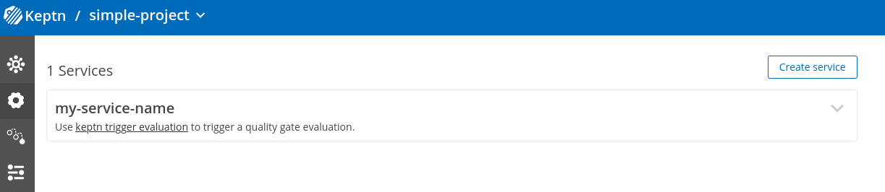

# Import Endpoint Example

This is an example for the Keptn import endpoint (released in Keptn 0.19.x).

We assume that you already have your Keptn API Endpoint as well as the API Token setup, e.g.:
```console
KEPTN_API_ENDPOINT=http://1.2.3.4.nip.io/api # please adapt that with your API URL
KEPTN_API_TOKEN=$(kubectl get secret keptn-api-token -n keptn -ojsonpath='{.data.keptn-api-token}' | base64 --decode) # or use the actual token
```

In addition, we assume that you already have a project created in Keptn, with a [simple shipyard file](simple-shipyard.yaml) with a `dev` stage, e.g.:
```console
PROJECT=simple-project
keptn create project $PROJECT --shipyard=simple-shipyard.yaml
```

Please pack the contents of import-package into a zip file, e.g.:
```console
cd import-package && zip -r ../import-package.zip . && cd ..
```

You can now call the import endpoint as follows:
```console
curl -X POST \
  "$KEPTN_API_ENDPOINT/v1/import?project=$PROJECT" \
  -H "accept: application/json" -H "x-token: $KEPTN_API_TOKEN" \
  -H "Content-Type: multipart/form-data" \
  -F "configPackage=@import-package.zip;type=application/zip"
```

## Expected Outcome

**Screenshots were captured using Keptn 0.18.2-dev**

### New Service Created



### New Webhook Subscription Created


### New Webhook Config Created


**Also in git**


### New Secret Created


## Cleanup

```console
keptn delete project $PROJECT
keptn delete secret slack-webhook
```

